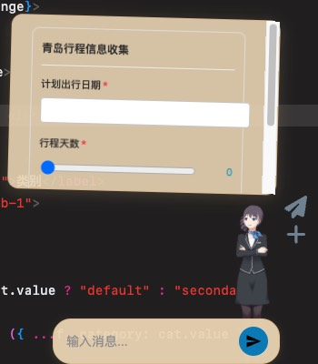
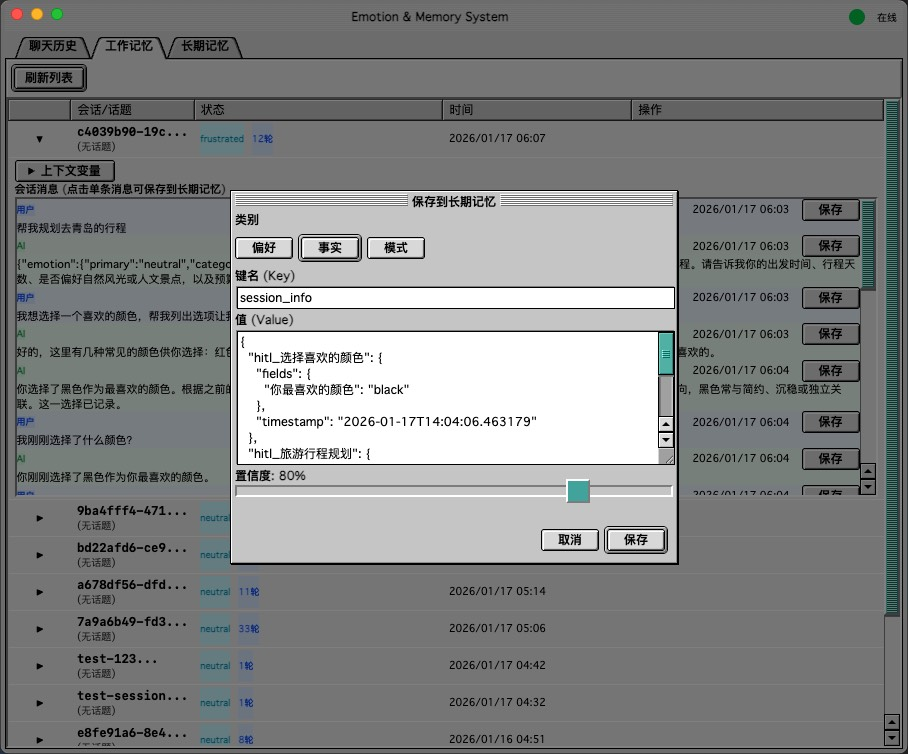

# Wenko

Customize Your Desktop AI Assistant!




## 项目结构

```
.
├── electron/                    # Electron 桌面应用
│   ├── main.js                  # 主进程
│   ├── live2d/live2d-widget/    # Live2D Widget 组件
│   └── src/renderer/workflow/   # Workflow 管理界面 (React)
├── workflow/                    # Python 后端服务
│   ├── main.py                  # FastAPI 入口
│   ├── chat_db.py               # 聊天记录数据库
│   └── data/                    # 数据目录 (SQLite)
└── openspec/                    # OpenSpec 规范文档
```

## 安装

### 1. Electron 应用

```bash
cd electron
npm install
```

### 2. Live2D Widget

```bash
cd electron/live2d/live2d-widget
npm install
```

### 3. Python 后端

```bash
cd workflow
pip install fastapi uvicorn httpx pydantic
```

### 4. 配置 AI 对话

```bash
cd workflow
cp chat_config.example.json chat_config.json
# 编辑 chat_config.json，填写 API Key
```

## 开发启动

### 启动后端服务

```bash
cd workflow
python main.py
# 服务运行在 http://localhost:8002
```

### 启动 Electron 应用

```bash
cd electron
npm start
```

### 构建 Live2D Widget（修改源码后）

```bash
cd electron/live2d/live2d-widget
npm run build
```

### 构建 Workflow UI（修改源码后）

```bash
cd electron
npm run build
```

## 打包

```bash
cd electron
npm run dist      # 构建安装包
npm run pack      # 仅构建目录（不打包安装器）
```

## 数据备份

聊天记录存储在 `workflow/data/chat_history.db`，备份时复制 `workflow/data/` 目录即可。数据库使用相对路径，可在不同机器间迁移。

## Archive info

archive_0914: Archive includes all the code (plugins suport for chrome, obs and the vector server and more) before 9/14/2025.

## Articles
- [DeepWiki](https://deepwiki.com/daijinru/wenko)
