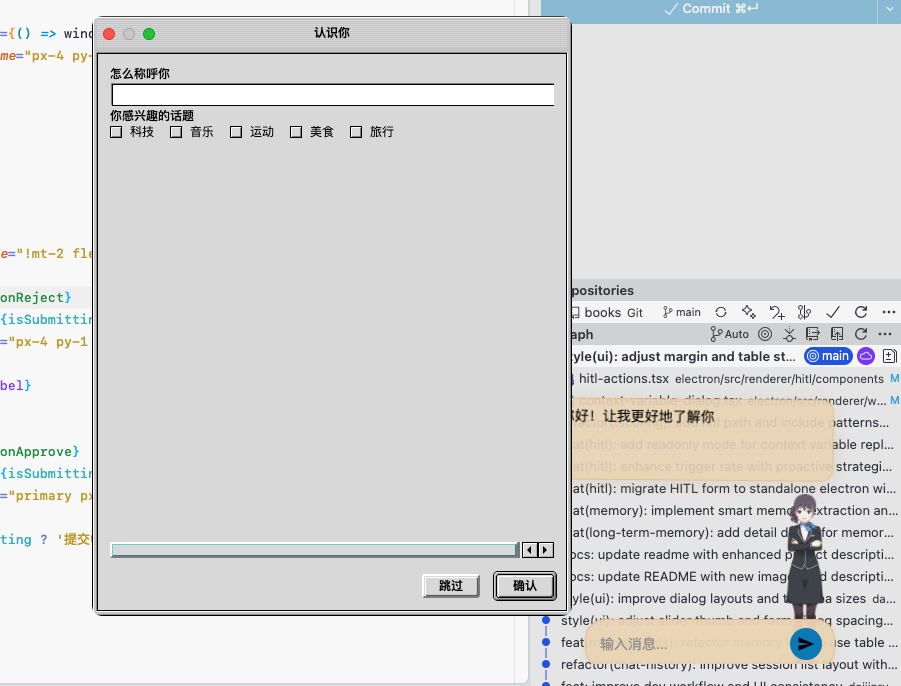
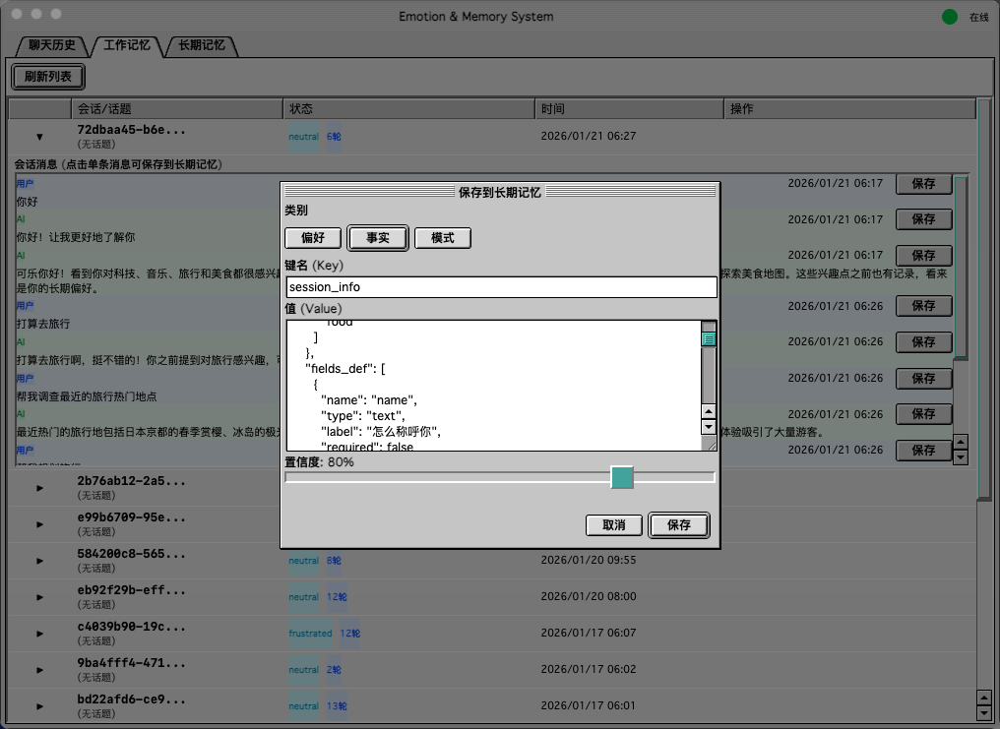

# Wenko 🤖

> **Your Intelligent Desktop Companion with Heart & Memory.**
> 打造你的专属桌面 AI 伴侣，具备情感记忆与 Live2D 形象。

[](https://deepwiki.com/daijinru/wenko)
[](https://opensource.org/licenses/MIT)
[](https://www.electronjs.org/)
[](https://fastapi.tiangolo.com/)
[](https://reactjs.org/)




## 📖 Introduction (简介)

**Wenko** is an open-source Desktop AI Assistant designed to be more than just a chatbot. It integrates **Live2D** avatars with a powerful **Memory & Emotion System**, creating a personalized and interactive experience.

Unlike standard AI tools, Wenko:
- **Remembers** your preferences and past conversations (Long-term Memory).
- **Understands** the context of your current work (Working Memory).
- **Reacts** with emotions, changing its expression based on the conversation.
- **Collaborates** with you through Human-in-the-Loop (HITL) workflows.

Wenko 是一个开源的桌面 AI 助手。它不仅是一个聊天机器人，更是一个拥有**情感**和**记忆**的数字伴侣。结合 Live2D 技术，Wenko 能以生动的形象陪伴你的工作与生活，并通过 Python 后端提供强大的记忆管理和工作流处理能力。

## ✨ Key Features (核心特性)

- **🧠 Advanced Memory System (双重记忆系统)**
  - **Long-term Memory**: Stores facts, user preferences, and historical data persistently using SQLite.
  - **Working Memory**: Maintains context for the current session, ensuring smooth multi-turn conversations.

- **❤️ Emotion Engine (情感引擎)**
  - Detects emotions from text (Joy, Sadness, Anger, Neutral, etc.).
  - Updates the Live2D avatar's expression in real-time to match the conversation mood.

- **🎨 Live2D Avatar (Live2D 形象)**
  - Fully interactive desktop widget.
  - Supports custom Live2D models (Cubism 2/5).
  - Touch and gaze interactions.

- **🤝 Human-in-the-Loop (HITL)**
  - Collaborative workflows where the AI proposes actions and you approve/edit them.
  - Perfect for complex tasks requiring human oversight.
  - Supports readonly replay mode for reviewing past decisions.

- **🖼️ Image Analysis (图片分析)**
  - Paste images directly into the app for instant preview.
  - OCR-powered text extraction from screenshots and images.
  - Save extracted content to Long-term Memory for future reference.

- **📊 Memory Dashboard (记忆管理面板)**
  - Visual management of Chat History, Working Memory, and Long-term Memory.
  - Browse, search, and organize your AI's memory data.
  - Transfer important context from Working Memory to Long-term Memory.

- **🔒 Privacy First (隐私优先)**
  - All chat history and memory data are stored locally (`workflow/data/`).
  - You control your data.

## 🛠️ Tech Stack (技术栈)

- **Frontend (Desktop)**: Electron, React, TypeScript, TailwindCSS, Vite
- **Avatar Engine**: Live2D Cubism SDK (Web)
- **Backend (Brain)**: Python, FastAPI, Uvicorn
- **Data Store**: SQLite (Chat History & Memory)
- **AI**: OpenAI API / Compatible LLMs

## 📂 Project Structure (项目结构)

```bash
.
├── electron/                    # Electron Desktop App
│   ├── main.cjs                 # Main Process
│   ├── src/                     # Renderer Process (React)
│   │   └── renderer/
│   │       ├── workflow/        # Memory Management UI (记忆管理界面)
│   │       ├── hitl/            # Human-in-the-Loop UI (人机协作界面)
│   │       └── image-preview/   # Image Preview & Analysis UI (图片预览分析界面)
│   └── live2d/live2d-widget/    # Live2D Widget Implementation
├── workflow/                    # Python Backend Service
│   ├── main.py                  # FastAPI Entry Point
│   ├── chat_db.py               # Chat History Database
│   ├── memory_manager.py        # Memory Logic
│   └── data/                    # Local Database (SQLite)
└── openspec/                    # Project Specifications
```

### Renderer Modules (渲染进程模块)

| Module | Description |
|--------|-------------|
| **workflow/** | 记忆管理系统界面。包含三个 Tab：聊天历史、工作记忆、长期记忆。用于查看和管理 AI 的对话记录与记忆数据。 |
| **hitl/** | Human-in-the-Loop 协作界面。当 AI 需要人工审核时弹出，用户可以审批或拒绝 AI 的操作请求，支持只读回放模式。 |
| **image-preview/** | 图片预览与分析界面。支持粘贴图片后进行 OCR 文字提取，并可将提取结果保存到长期记忆中。 |

## 🚀 Getting Started (快速开始)

### Prerequisites (前置要求)

- Node.js (v18+)
- Python (v3.10+)
- OpenAI API Key (or compatible)

### Installation (安装)

1.  **Setup Backend (Python)**
    ```bash
    cd workflow
    uv sync
    ```

2.  **Configure AI**
    ```bash
    cd workflow
    cp chat_config.example.json chat_config.json
    # Edit chat_config.json and add your API Key
    ```

3.  **Setup Frontend (Electron)**
    ```bash
    cd electron
    npm install
    ```

4.  **Setup Live2D Widget**
    ```bash
    cd electron/live2d/live2d-widget
    npm install
    ```

### Running the App (启动应用)

```bash
# Start Backend
cd workflow && ./start.sh

# Start Electron (in another terminal)
cd electron && ./start.sh
```

### Building (构建)

#### 1. Build Live2D Widget (构建 Live2D 组件)

Live2D Widget 需要先构建，因为 Electron 应用依赖它：

```bash
cd electron/live2d/live2d-widget
npm run build
```

#### 2. Build Electron App (构建 Electron 客户端)

构建桌面客户端可执行文件：

```bash
cd electron
npm run dist
```

构建完成后，可执行文件位于 `electron/dist/` 目录：
- **macOS**: `dist/Wenko-x.x.x.dmg` 或 `dist/mac/Wenko.app`
- **Windows**: `dist/Wenko Setup x.x.x.exe`
- **Linux**: `dist/Wenko-x.x.x.AppImage`

#### 3. Deploy Backend Service (部署后端服务)

后端服务需要独立运行，为 Electron 客户端提供 AI 能力：

```bash
cd workflow

# 安装依赖
uv sync

# 配置 API Key
cp chat_config.example.json chat_config.json
# 编辑 chat_config.json 填入你的 API Key

# 启动服务
./start.sh
# 或手动启动: uv run uvicorn main:app --host 0.0.0.0 --port 8000
```

后端服务默认运行在 `http://localhost:8000`。

#### Production Deployment (生产部署)

对于生产环境，建议：

1. **后端服务**: 使用 systemd 或 Docker 管理后端进程
2. **客户端配置**: 确保客户端指向正确的后端服务地址
3. **数据备份**: 定期备份 `workflow/data/` 目录中的 SQLite 数据库

## 📄 License

Distributed under the **MIT License**. See `LICENSE` for more information.

## 🔗 Related

- [DeepWiki Article](https://deepwiki.com/daijinru/wenko)
