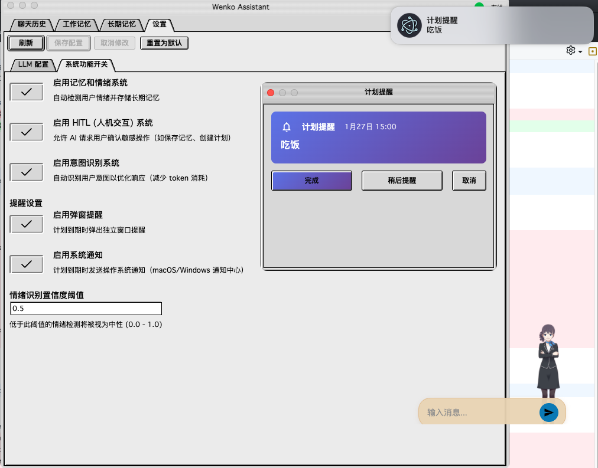
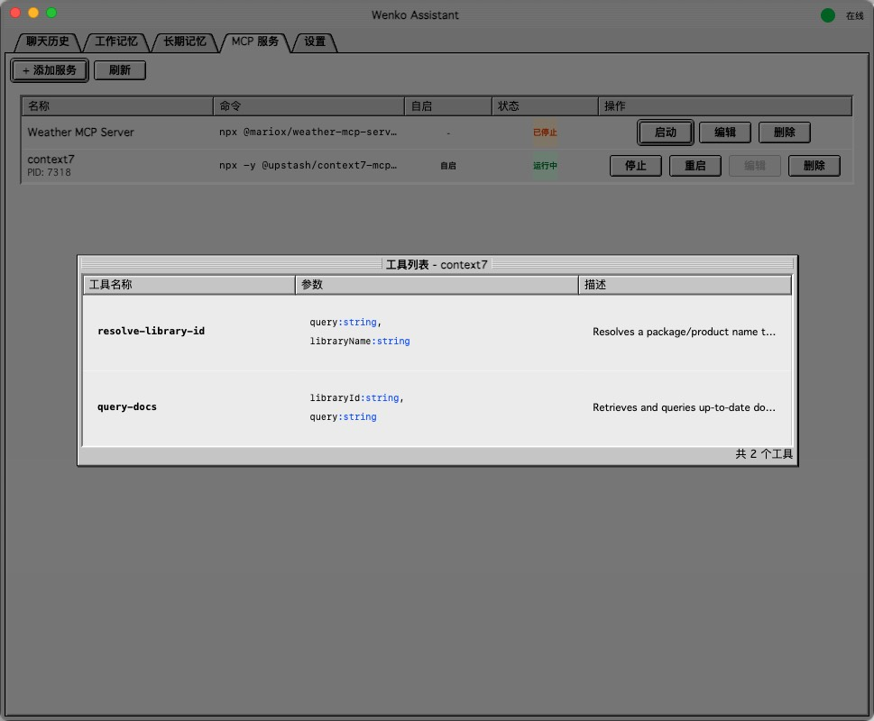
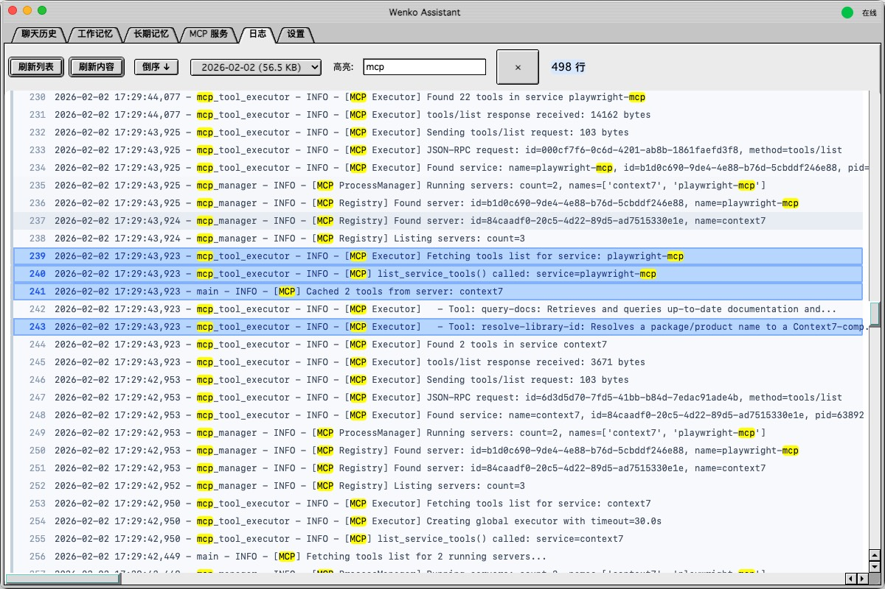
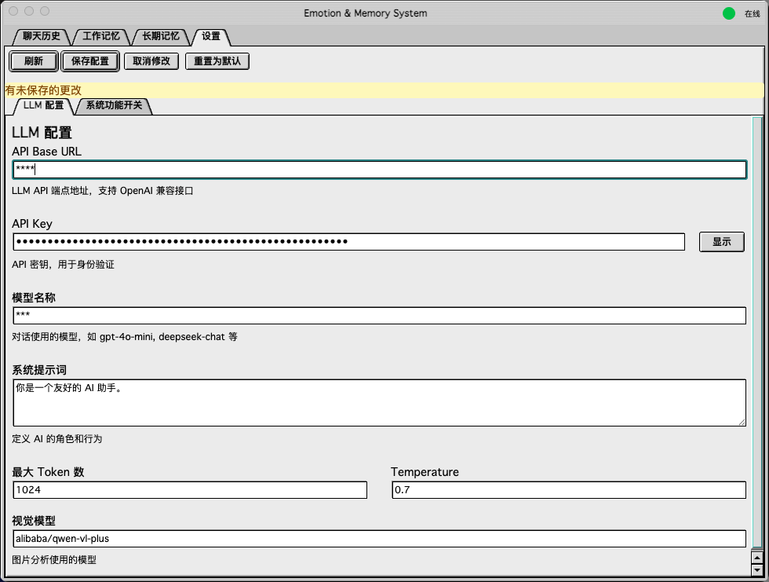

# Wenko 🤖

**[English](./README.md)** | **[中文](./README_CN.md)**

> **打造你的专属桌面 AI 伴侣，具备情感记忆与 Live2D 形象。**

[](https://deepwiki.com/daijinru/wenko)
[](https://opensource.org/licenses/MIT)
[](https://www.electronjs.org/)
[](https://fastapi.tiangolo.com/)
[](https://reactjs.org/)




## 📖 简介

**Wenko** 是一个开源的桌面 AI 助手。它不仅是一个聊天机器人，更是一个拥有**情感**和**记忆**的数字伴侣。结合 Live2D 技术，Wenko 能以生动的形象陪伴你的工作与生活，并通过 Python 后端提供强大的记忆管理和工作流处理能力。

与传统 AI 工具不同，Wenko 能够：
- **记住**你的偏好和过往对话（长期记忆）
- **理解**你当前工作的上下文（工作记忆）
- **表达**情感，根据对话内容改变表情
- **协作**通过人机协作（HITL）工作流与你共同完成任务

## ✨ 核心特性

- **🧠 双重记忆系统**
  - **长期记忆**：使用 SQLite 持久化存储事实、用户偏好和历史数据
  - **工作记忆**：维护当前会话的上下文，确保多轮对话的流畅性

- **❤️ 情感引擎**
  - 从文本中检测情感（喜悦、悲伤、愤怒、中性等）
  - 实时更新 Live2D 形象的表情以匹配对话氛围

- **🎨 Live2D 形象**
  - 完全交互式的桌面小组件
  - 支持自定义 Live2D 模型（Cubism 2/5）
  - 支持触摸和注视交互

- **🤝 人机协作 (HITL)**
  - AI 提出操作建议，由你审批或编辑的协作工作流
  - 适合需要人工监督的复杂任务
  - 支持只读回放模式，用于回顾历史决策
  - 可视化展示结构化内容（表格、列表、代码块等）

- **🖼️ 图片分析**
  - 直接粘贴图片到应用中即时预览
  - 基于 OCR 的截图和图片文字提取
  - 将提取内容保存到长期记忆供后续参考

- **📊 记忆管理面板**
  - 可视化管理聊天历史、工作记忆和长期记忆
  - 浏览、搜索和整理 AI 的记忆数据
  - 将重要上下文从工作记忆转移到长期记忆

- **⏰ 计划提醒**
  - 使用自然语言创建提醒（例如："今天下午15点30分提醒我吃下午茶"）
  - 支持弹窗提醒和操作系统级通知（macOS/Windows）
  - 可直接在提醒中延后、忽略或标记计划完成
  - 支持每日、每周或自定义周期的重复提醒

- **🔌 MCP（模型上下文协议）**
  - 通过 MCP 服务器扩展 Wenko 的能力，接入外部工具
  - 简便的 MCP 服务注册和管理
  - 支持已配置 MCP 服务器的自动启动
  - 触发关键词可在对话中自然调用特定工具



- **📋 日志查看器**
  - 在 Electron 面板中直接查看后端日志
  - 通过下拉菜单按日期筛选日志文件
  - 支持正序/倒序切换显示
  - 关键字高亮，快速定位内容
  - 日志级别着色（INFO、WARN、ERROR、DEBUG）
  - 点击高亮特定日志行，方便对比查看



- **🔒 隐私优先**
  - 所有聊天历史和记忆数据都存储在本地（`workflow/data/`）
  - 你完全掌控自己的数据

## 🛠️ 技术栈

- **前端（桌面端）**：Electron、React、TypeScript、TailwindCSS、Vite
- **形象引擎**：Live2D Cubism SDK (Web)
- **后端（大脑）**：Python、FastAPI、Uvicorn
- **数据存储**：SQLite（聊天历史与记忆）
- **AI**：OpenAI API / 兼容的 LLM

## 📂 项目结构

```bash
.
├── electron/                    # Electron 桌面应用
│   ├── main.cjs                 # 主进程
│   ├── src/                     # 渲染进程 (React)
│   │   └── renderer/
│   │       ├── workflow/        # 记忆管理界面
│   │       ├── hitl/            # 人机协作界面
│   │       └── image-preview/   # 图片预览分析界面
│   └── live2d/live2d-widget/    # Live2D 组件实现
├── workflow/                    # Python 后端服务
│   ├── main.py                  # FastAPI 入口
│   ├── chat_db.py               # 聊天历史数据库
│   ├── memory_manager.py        # 记忆逻辑
│   └── data/                    # 本地数据库 (SQLite)
└── openspec/                    # 项目规范
```

### 渲染进程模块

| 模块 | 描述 |
|--------|-------------|
| **workflow/** | 记忆管理系统界面。包含三个 Tab：聊天历史、工作记忆、长期记忆。用于查看和管理 AI 的对话记录与记忆数据。 |
| **hitl/** | 人机协作界面。当 AI 需要人工审核时弹出，用户可以审批或拒绝 AI 的操作请求，支持只读回放模式和结构化内容可视化展示。 |
| **image-preview/** | 图片预览与分析界面。支持粘贴图片后进行 OCR 文字提取，并可将提取结果保存到长期记忆中。 |

## 🚀 快速开始

### 前置要求

- Node.js (v18+)
- Python (v3.10+)
- OpenAI API Key（或兼容的 API）

### 安装

1.  **安装后端 (Python)**
    ```bash
    cd workflow
    uv sync
    ```

2.  **安装前端 (Electron)**
    ```bash
    cd electron
    npm install
    ```

3.  **安装 Live2D 组件**
    ```bash
    cd electron/live2d/live2d-widget
    npm install
    ```

### 启动应用

```bash
# 启动后端
cd workflow && ./start.sh

# 启动 Electron（在另一个终端）
cd electron && ./start.sh
```

启动应用后，首先填写 LLM 配置信息：


### 构建

#### 1. 构建 Live2D 组件

Live2D 组件需要先构建，因为 Electron 应用依赖它：

```bash
cd electron/live2d/live2d-widget
npm run build
```

#### 2. 构建 Electron 客户端

构建桌面客户端可执行文件：

```bash
cd electron
npm run dist
```

构建完成后，可执行文件位于 `electron/dist/` 目录：
- **macOS**: `dist/Wenko-x.x.x.dmg` 或 `dist/mac/Wenko.app`
- **Windows**: `dist/Wenko Setup x.x.x.exe`
- **Linux**: `dist/Wenko-x.x.x.AppImage`

#### 3. 部署后端服务

后端服务需要独立运行，为 Electron 客户端提供 AI 能力：

```bash
cd workflow

# 安装依赖
uv sync

# 启动服务
./start.sh
# 或手动启动: uv run uvicorn main:app --host 0.0.0.0 --port 8000
```

后端服务默认运行在 `http://localhost:8000`。

#### 生产部署

对于生产环境，建议：

1. **后端服务**：使用 systemd 或 Docker 管理后端进程
2. **客户端配置**：确保客户端指向正确的后端服务地址
3. **数据备份**：定期备份 `workflow/data/` 目录中的 SQLite 数据库

## 📄 许可证

本项目采用 **MIT 许可证**。详情请参阅 `LICENSE` 文件。

## 🔗 相关链接

- [DeepWiki 文章](https://deepwiki.com/daijinru/wenko)
